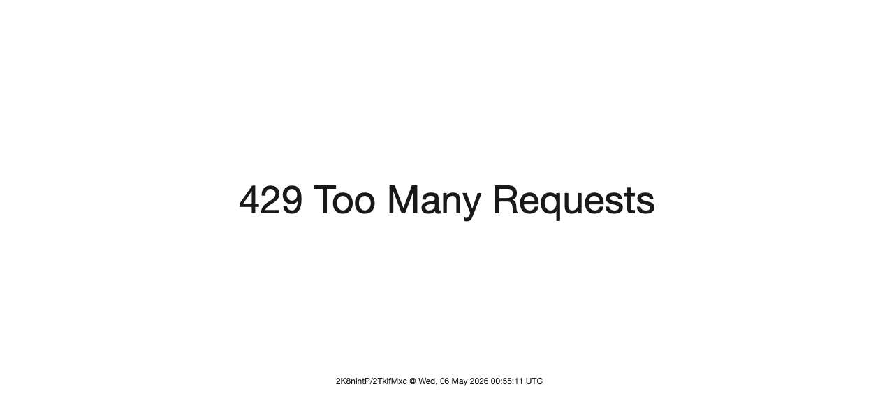

# macOS Bug Bounty Recon Setup by Kent Leckie

**Capturing the attack surface — the same way I capture moments behind the lens.**

A complete, one-command bug bounty / pentest recon pipeline built on a **MacBook Pro (zsh + Homebrew)**.

## What This Repo Shows
- Full tool installation + troubleshooting (conda vs Homebrew PATH hell)
- One-click recon script (`recon-kent.sh`)
- Real output from scanning my own domain (`kentlphotography.com`)
- Screenshots, nmap, ffuf, nikto, gowitness — all chained together
- Professional documentation for employers / future self

## Environment I Built This On
- **Device**: MacBook Pro (Apple Silicon)
- **OS**: macOS (May 2026)
- **Shell**: zsh
- **Package manager**: Homebrew
- **Challenges overcome**: conda PATH conflicts, whatweb Ruby errors, gowitness flag changes, Squarespace rate-limiting

## One-Click Recon Script

Just run: `~/recon-kent.sh`

**It does:**
- Subdomain enumeration (subfinder)
- Live host check (httpx)
- Port scan (nmap)
- Directory fuzzing (ffuf)
- Visual screenshots (gowitness)
- Vulnerability scan (nikto)

## Skills Demonstrated
- Tool chaining & automation
- macOS-specific troubleshooting
- Safe, ethical recon on own assets
- Clear technical documentation
- Understanding modern hosting behavior (Squarespace)

## Future Enhancements (planned)
- JS endpoint extraction
- Git secret scanning (trufflehog)
- Cloud/S3 bucket checks
- Auto HTML report generation

---

Built by Kent Leckie — Photographer | Aspiring SOC Analyst | Bug Bounty Learner  
[kentlphotography.com](https://www.kentlphotography.com) | LinkedIn  
*Turning curiosity into capability — one terminal command at a time.*
